# Ultimate-Streaming-Guide

  
## Table of Content
1. [ Project Links ](#Links)
2. [ Project Context ](#context)
3. [ Project Objectives ](#objectives)
4. [ Outcome ](#Outcome)
5. [ Screenshots ](#Screenshots)
6. [Challenges & What We've Learned](#learned)
7. [Installation](#Installation)
8. [Credits](#Credits)
9. [Project wireframe](#wireframe)
10. [ License ](#License)
#

#

### 1. Project Links 

#### Website Link
https://imbingz.github.io/Ultimate-Streaming-Guide/

#### Work-Files Link
https://github.com/imbingz/Ultimate-Streaming-Guide

### 2. Project Context - User Story
AS A Movieholic  
I WANT to easily find all shows/movies and where they are streamable. 
I WANT to be able to browse movies/shows to find something new to watch. 
SO THAT I can save time and quickly find what I want. 

### 3. Project Objectives
* Use [omdb API](http://www.omdbapi.com/) and [Utelly API](https://rapidapi.com/utelly/api/utelly) to create an application where the user can search for specific movies and tv shows and see where they are streamable from as well as brows movies by genre and receive basic information about that movie or show (Plot, Rating, Actors, etc)

* It will also feature a clean and polished user interface and be responsive, ensuring that it adapts to multiple screen sizes.

### 4. Outcome
* The user interface is responsive to different devices - mobile, tablets, laptops and larger screen desktops
* The app is dynamic and functional with both movie and TV shows. 
* Users can click the streaming logos to watch the movies. 
* Users can save movies and see their saved movies displayed even after refresh.
* Users can also remove saved movies from both saved movie display area as well as localStorage. 

### 5. Screenshots 

#### Screenshots - Mobile View
<kbd>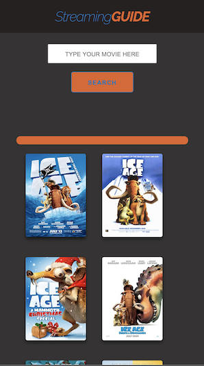</kbd>
<kbd>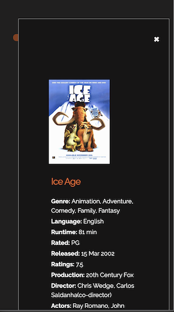</kbd>
<kbd>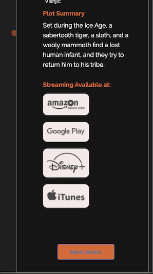</kbd>

####  Screenshots - Laptop view 
<kbd>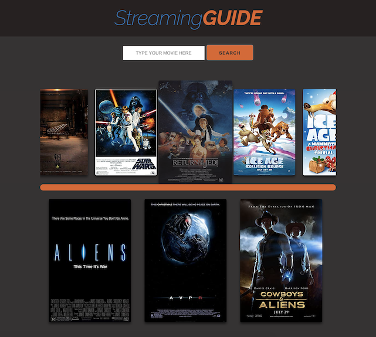</kbd>
<kbd>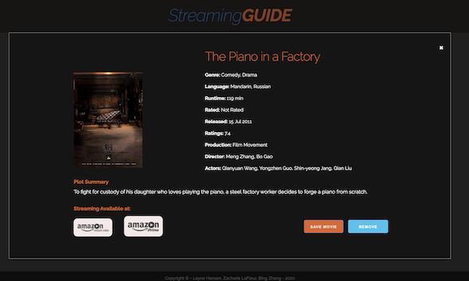</kbd>

### 6. Installation
* Access to GitHub.com and a code editor such as vscode is necessary
* Go to [github.com/imbingz/imbingz.github.io.](https://github.com/imbingz/Ultimate-Streaming-Guide)
* Click on the green button that says Clone or Download
* Choose how you would like to download: using the SSH/HTTPS keys or download the zip file
* Using SSH/HTTPS Key: You will copy the link shown and open up either terminal (mac: pre-installed) or gitbash (pc: must be installed). Once the application is open, you will type git clone paste url here. Once you have cloned the git repo, cd into the repo and type open. to open the folder which contains all files used for the website. Once inside the folder, click on index.html to open the website in the browser.
* Using Download ZIP: Click on Download Zip. Locate the file and double click it to unzip the file. Locate the unzipped folder and open it. All the files for the website will be within this folder. Click on index.html to open the website in the browser.
* If you like to test this App, please click the link [here](https://imbingz.github.io/Ultimate-Streaming-Guide/)

### 7. Credits:
This project would not be complete without the help, advice, and guidance from our Instructor Alex and TAs katie @fkakatie, Mason @LtWilhelm, and Christoper Sanner. The following resources also contribute to this project. The last but not least, our awesome team members and synergy among us surely helped get this project done magically. 

* [Omdb API](http://www.omdbapi.com/)
* [Utelly API](https://rapidapi.com/utelly/api/utelly)
* [Skeleton CSS](http://getskeleton.com/)
* [Mozilla HTML5 Guide](https://developer.mozilla.org/en-US/docs/Web/Guide/HTML/HTML5) 
* [w3 School Modal](https://www.w3schools.com/howto/howto_css_modals.asp) 
* [Mozilla JavaScript](https://developer.mozilla.org/en-US/docs/Web/JavaScript) 
* [JQuey API](https://api.jquery.com/) 
* [Visual Studio Code](https://code.visualstudio.com/) 
* [Favicon Used](https://freepngimg.com/png/18709-television-free-download-png/icon) 
* [Color Palette](https://colorhunt.co/) 
* [Detect When an Image Fails to Load](https://stackoverflow.com/questions/9815762/detect-when-an-image-fails-to-load-in-javascript)

### 8. Challenges & What We've Learned
[Layne Hansen]@LayneHansen
* Often the biggest struggle is making adjustments to changes on the page. When a new element is added, other elements need to be changed to accommodate the change. Most specifically, getting the button the removes movies from the search scroll was very difficult.

[Bing Zhang]@imbingz
* Adding event handler to dynamically generated elements is one of the most challenging tasks through this project. Since we appended block of HTML elements together instead of generating each of them one at time, many times the event handler added to the button return as unfound elements. Using event delegation solved most of this kind of issue. As for the remove-movie button, we tried all possible solutions we could think of and still could not add the event handler to the button, so, we added “onclick” attribute to the element when we generated it and had to move the click function script to HTML. It does not look pretty, but it worked. 
* Saving the right data to localStorage each time when a user click the save-movie button was also more complicated than I originally anticipated, because each image has its id, src and alt with movie title. The best way i found is to add those attributes to the button, and create an array of objects with properties id, src and title. So, each time, the user click save-movie button, the button will collect the right info to store. 
* Using branches and collaborating with others on github was quite challenging for me. I certainly did not push as often as I usually do in the solo projects. However, I also learnt how important is good communication among team. A clear delegation of task certainly helped reduce the number of merge conflicts.
* Additionally, what I learned most is the power of team and having a well-thought plan. I truly enjoyed working with my team mates Layne Hansen @LayneHansen and Zacharie LaFleur @MrCartre. Everything flowed seamlessly during the entire project. It is such comfort to know I have a team that I can rely on and get help from when needed. We set project schedule and plans from the very beginning and were ahead of our schedule every step on the way. I am extremely grateful for having this opportunity to work with them. 

[Zach LaFleur]@MrCartree
* Learning how there are different types of ajax calls that can be used. Such as the difference between our IMDB ajax call and our UTelly ajax call. The UTelly used a few different arguments, one with the URL and then a variable with an object that holds all the other information needed to complete the call and to get the information. That was a really interesting thing that I was able to learn from this project.
* Learning how to examine another persons code and to learn what is needed from that to make changes or repairs and debug a few things. Everybody writes code differently just like how everbody writes or speaks differently. Learning the different ways to follow the paths and to examine what other people have written and why was a really interesting and fun thing.
* Learning about Template Literals or Template Strings was a really cool thing. By using back ticks and the fancy Template Literal "${}" that was a really cool way to add new things to the code, from generating HTML code and creating those elements from the JS file to using it to grab variables or different needed data at different points in the code. I found it to be really cool and interesting.
* The best part was all the things I was able to learn from my cohorts as well. Seeing the way the did things either in CSS or JS and watching the way they were able to manipulate the page to do what they wanted was really cool. I was able to look through what they had done and see the exact changes and how they worked! I thought it was a relaly cool use of the Hover in CSS the way the elements that were hovered over could change and the amount of time to make that change could be adjusted as well. Super cool.

### 9. Project Wireframe
<kbd>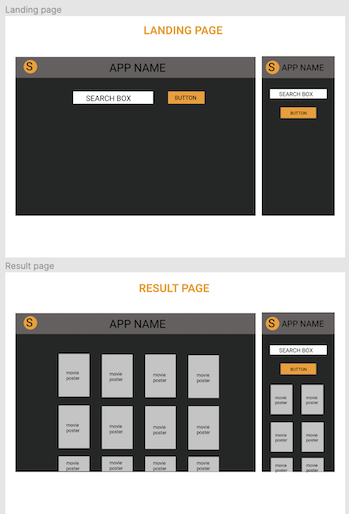</kbd>
<kbd>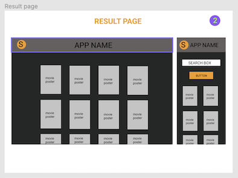</kbd>
<kbd>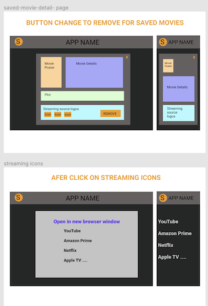</kbd>
<kbd>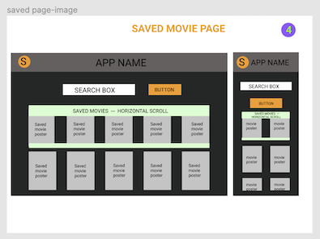</kbd>
<kbd>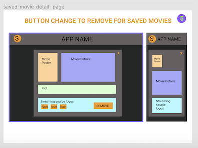</kbd>
<kbd>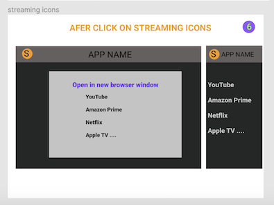</kbd>

### 10. License
##### MIT License

Copyright (c) [2020] [bingzhang][Layne Hansen] [Zacharie LaFleur] 

Permission is hereby granted, free of charge, to any person obtaining a copy of this software and associated documentation files (the "Software"), to deal in the Software without restriction, including without limitation the rights to use, copy, modify, merge, publish, distribute, sublicense, and/or sell copies of the Software, and to permit persons to whom the Software is furnished to do so, subject to the following conditions:

The above copyright notice and this permission notice shall be included in all copies or substantial portions of the Software.

THE SOFTWARE IS PROVIDED "AS IS", WITHOUT WARRANTY OF ANY KIND, EXPRESS OR IMPLIED, INCLUDING BUT NOT LIMITED TO THE WARRANTIES OF MERCHANTABILITY, FITNESS FOR A PARTICULAR PURPOSE AND NON-INFRINGEMENT. IN NO EVENT SHALL THE AUTHORS OR COPYRIGHT HOLDERS BE LIABLE FOR ANY CLAIM, DAMAGES OR OTHER LIABILITY, WHETHER IN AN ACTION OF CONTRACT, TORT OR OTHERWISE, ARISING FROM, OUT OF OR IN CONNECTION WITH THE SOFTWARE OR THE USE OR OTHER DEALINGS IN THE SOFTWARE.

September 5, 2020.
